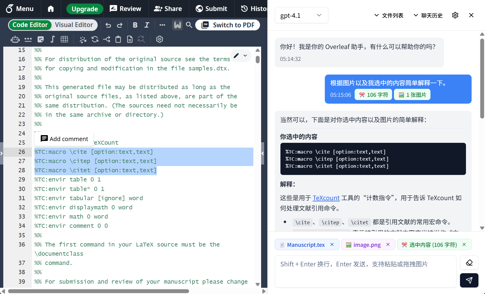
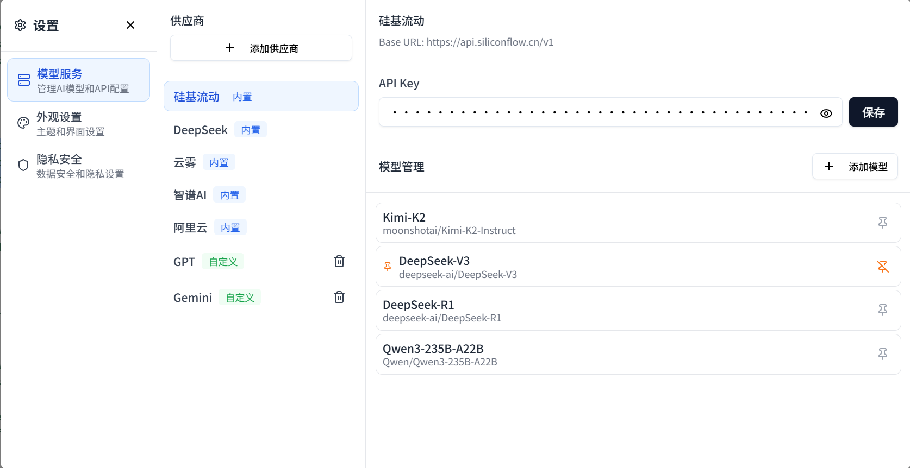
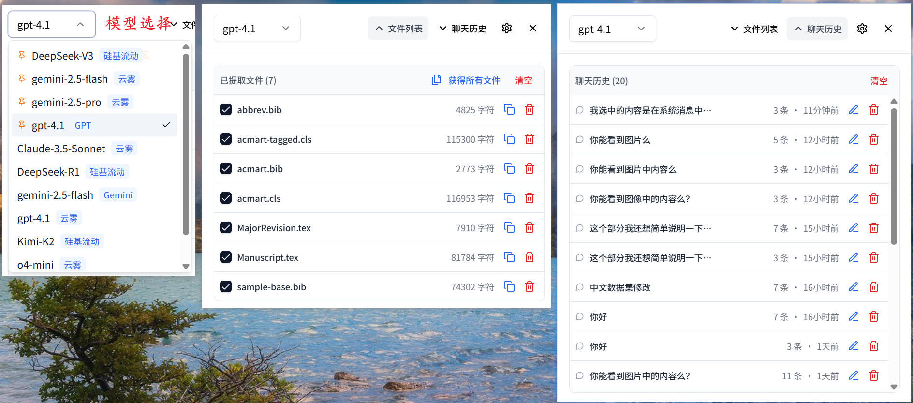

<p align="center">
  
</p>

<h1 align="center">Chat Overleaf ✨</h1>

<p align="center"><b>Overleaf AI 助手 | 基于 Plasmo 的 Overleaf AI 对话助手</b></p>

<p align="center">
  <a href="https://chromewebstore.google.com/detail/chat-overleaf/anofakjncihlgcmndcdipflonpgcgdmk">
    
  </a>
</p>

---

## 📥 安装方式

### 方式一：Chrome 商店安装（推荐）

直接从 Chrome 网上应用店安装：

👉 [**点击安装 Chat Overleaf**](https://chromewebstore.google.com/detail/chat-overleaf/anofakjncihlgcmndcdipflonpgcgdmk)

### 方式二：手动加载 zip

1. 下载 GitHub Releases 中的 zip 文件并解压

2. 在 Chrome 浏览器中加载插件
   - 打开 Chrome 扩展管理页面（`chrome://extensions/`）
   - 开启右上角的「开发者模式」
   - 点击「加载已解压的扩展程序」
   - 选择解压目录下的 `chrome-mv3-prod` 文件夹

3. 完成加载后，访问 Overleaf 网站点击右下角图标即可（注意先添加模型秘钥）

---

## 🚀 基本功能

### 💬 智能对话系统
- 👥 <b>无缝集成</b>：完美融入 Overleaf 界面，不影响正常编辑体验
- 📝 <b>选中文本提问</b>：选中编辑器内容即可直接提问，自动作为上下文
- 🖼️ <b>多模态支持</b>：支持图片上传、粘贴和拖拽，实现图文混合对话
- 📱 <b>响应式设计</b>：支持侧边栏宽度调整，适配不同屏幕尺寸
- 💭 <b>思考过程展示</b>：支持显示 AI 的思考过程

### 📁 文件内容管理
- 📄 <b>智能提取</b>：自动获取当前文件或手动点击即可提取整个项目内容作为 AI 上下文
- 🌲 <b>文件树视图</b>：以树形结构展示项目文件，支持文件夹展开/折叠
- 🔄 <b>实时同步</b>：编辑器内容变化时自动更新已提取的文件
- 📋 <b>文件选择</b>：灵活选择需要包含在对话中的文件
- 💾 <b>文件缓存</b>：按项目 ID 缓存文件列表，避免重复获取
- 📊 <b>Token 预估</b>：显示选中文件的预估 Token 数量
- ✅ <b>批量操作</b>：支持全选/清空文件选择

### 💾 对话历史管理
- 📚 <b>历史记录</b>：自动保存对话历史，支持加载和管理多个会话
- 🌿 <b>分支对话</b>：支持从历史消息创建新的对话分支
- 🗑️ <b>批量管理</b>：支持删除单个或清空所有历史记录

### 🧠 模型管理
- 🔧 <b>内置模型</b>：预配置多个主流 AI 模型（DeepSeek、Kimi、Qwen、Gemini 等）
- ⚙️ <b>自定义模型</b>：支持添加自定义 AI 服务商和模型
- 📌 <b>模型置顶</b>：常用模型可置顶显示，快速切换
- 🔍 <b>自动获取模型列表</b>：输入模型 ID 后自动获取对应服务商的模型列表

### 🎯 便捷交互
- ⌨️ <b>@ 快捷引用</b>：使用 @ 符号快速引用文件
- 🎨 <b>优化的 UI</b>：更紧凑的界面设计，提升使用体验

### 📝 智能插入与差异审阅
- 🧩 <b>AI 生成替换块</b>：聊天气泡自动渲染搜索/替换 diff，支持正则或普通模式
- 🚀 <b>一键应用/拒绝</b>：直接将修改写回 Overleaf 编辑器或忽略
- 👀 <b>智能预览与高亮</b>：自动跳转并高亮待替换区域，支持悬浮浮层内联查看
- ↩️ <b>撤销应用/撤销拒绝</b>：已应用或已拒绝的修改可恢复为候选并重新高亮

---

##  界面预览






---

## 🛠️ 本地开发

### 环境要求
- Node.js 16+
- pnpm

### 开发步骤

1. 克隆项目

   ```bash
   git clone https://github.com/anuin-cat/chat-overleaf.git
   cd chat-overleaf
   ```

2. 安装依赖

   ```bash
   pnpm install
   ```

3. 启动开发服务器

   ```bash
   pnpm dev
   ```

4. 加载插件到浏览器
   - 打开 Chrome 扩展管理页面（`chrome://extensions/`）
   - 开启开发者模式
   - 点击「加载已解压的扩展程序」
   - 选择 `build/chrome-mv3-dev` 文件夹

5. 访问 Overleaf 网站测试功能

---

## 📦 构建生产版本

```bash
pnpm build
```

---

## 📋 TODO

- [x] ✍️ 支持添加编辑器选中内容对话
- [x] 💾 添加对话历史持久化
- [x] 🔄 支持当前编辑器内容自动更新
- [x] 🧩 优化上下文选中逻辑
- [ ] 📝 支持自定义 prompt 模板
- [x] 🛠️ 支持自定义添加模型
- [x] 🖼️ 支持图文问答
- [x] 🌲 文件树视图展示
- [x] 💾 文件列表缓存机制
- [x] 📊 Token 数量预估
- [x] ⌨️ @ 快捷引用功能
- [x] 💭 思考过程展示
- [x] 🔍 自动获取模型列表

---

### ⚡️ 基于 [Plasmo](https://github.com/PlasmoHQ/plasmo) 构建

